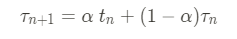

# what we gonna study

CPU 스케쥴링은 멀티프로그램 운영체제의 기초이다. 프로세스간에 CPU를 교체하는 것은, 운영체제가 컴퓨터를 더욱 생산적으로 만든다. 이 챕터에서는, 우리는 CPU 스케쥴링 개념과 리얼타임 시스템에서의 몇가지 CPU 스케쥴링 알고리즘을 보이겠다. 우리는 또한 특정 시스템에서 알고리즘을 고르는 문제를 고려하겠다. 

챕터 4에서, 우리는 프로세스-스레드 모델을 소개했다. 현재의 운영체제에서 프로세스가 아닌 커널 레벨 스레드이고 실제로 운영체제에 의해서 스케쥴된다. 그러나, "프로세스 스케쥴링"과 "스레드 스케쥴링"은 보통 혼용되어 쓰인다. 이 챕터에서, 우리는 프로세스는 일반적인 개념을 말할때 쓰고 스레드는 스레드 특정 지식을 의미할 때 사용하겠다.

비슷하게, 챕터 1에서 우리는 코어가 어떻게 CPU의 기초 단위인지 설명했고, 프로세스가 CPU의 코어에서 작동한다 했다. 그러나, 많은 곳에서, 우리는 프로세스 스케쥴링의 언어를 "run on a CPU"라고 표현할 것이고, 우리는 프로세스가 CPU의 코어에서 작동한다는 의미이다.

# Objectives

- 여러가지 CPU 스케쥴링 알고리즘을 접한다.
- 스케쥴링 기준에 따라서 스케쥴링 알고리즘을 평가한다.
- 멀티 프로세서와 멀티코어 스케쥴링에서의 이슈를 설명한다.
- 리얼-타임 스케쥴링 알고리즘을 설명한다.
- 윈도우, 리눅스, 솔라리스 운영체제에서의 스케쥴링 알고리즘을 본다.
- CPU 스케쥴링 알고리즘을 평가하기 위해서 모델링과 시뮬레이션을 적용한다.
- 몇가지 다른 CPU 스케쥴링 알고리즘을 디자인한다.

## 5.1. 기본 개념

싱글코어 시스템에서, 오직 하나의 프로세스가 한번에 작동한다. 다른 프로세스들은 반드시 CPU의 코어가 자유가 되고 다시 스케쥴되어야한다. 멀티프로그래밍의 목적은 프로세스가 모든 시간동안 동작하고, CPU의 효율을 극대화하는 것이다. 아이디어는 꽤나 단순하다. 프로세스는 실행되기전까지 대기해야한다.(보통은 I/O 요청시간이다.) 단순한 컴퓨터 시스템에서, CPU는 휴식을 취한다. 모든 대기시간은 낭비된다. 어떠한 유용한 일들도 성취되지 않는다. 멀티프로그래밍과 함께라면, 우리는 이 시간을 생산적으로 사용하려고한다. 몇몇 프로세스들은 메모리에 동시에 대기한다. 프로세스가 기다려야하면, 운영체제는 프로세스를 CPU 밖으로 내보내고 다른 프로세스를 가지고 온다. 이런 패턴이 지속된다. 프로세스가 기다려야 할때마다, 다른 프로세스는 CPU를 점유한다. 멀티코어 시스템에서, CPU를 바쁘게 유지하는 것은 모든 프로세싱 코어로 확장된다.

이런 종류의 스케쥴링은 운영체제 기능에서 기본적이다. 대부분의 컴퓨터 자원은 사용전에 스케쥴된다. CPU는 물론이고 대부분의 컴퓨터 리소스들이다. 그러므로, 그것들의 스케쥴링은 운영체제 디자인에서 주요하다.

### 5.1.1 CPU-I/O Burst Cycle

CPU 스케쥴링의 성공은 프로세스의 자원 관측에 달려있다. 프로세스 실행은 CPU 실행과 I/O 대기의 **사이클**로 이루어져있다. 프로세스들은 두가지 상태를 오간다. 프로세스 실행은 **CPU Burst**와 함께 시작한다. 그것은 **I/O Burst**를 뒤따른다. 그리고 다른 CPU burst를 따르고 또 I/O Burst를 따르고, 마침내, 마지막 CPU Burst은 시스템 리퀘스트로 실행을 종료한다. 

CPU Burst의 시간은 확장적으로 측정이 된다. 비록 그들이 프로세스-프로세스/컴퓨터-컴퓨터 간에 크게 다르지만, 그들은 주기에 따라 갈린다. 그들은 지수승으로 일반화되고, 많은 수의 short CPU burst와 적은 수의 long CPU burst로 나뉜다. I/O-bound 프로그램은 보통 short CPU-burst를 가진다. CPU-Bound 프로그램은 적은 long CPU-burst를 가진다. 이런 분포는 CPU 스케쥴링 알고리즘을 구현할 때 중요하다.

### 5.1.2 CPU 스케쥴러

CPU가 휴게를 가질때마다, 운영체제는 레디큐의 프로세스를 골라서 실행한다. 선택 프로세스는 **CPU 스케쥴러**가 가져오고, 메모리에서 실행할 준비가 된 프로세스 들에서 프로세스를 선택하고 CPU에 프로세스를 할당한다.

모든 레디큐는 FIFO일 필요가 없다는 것을 명심하자. 우리가 볼 스케쥴링 알고리즘에서 레디큐는 FIFO 큐, 우선순위 큐, 트리, 비정렬 링크드 리스트로 구현될 수 있다. 개념적으로, 그러나, 모든 레디큐의 프로세스들은 CPU에서 실행할 찬스를 기다리며 줄서있다. 큐에서의 레코드들은 보통 PCB이다. 

### 5.1.3 비선점과 선점 스케쥴링

CPU 스케쥴링 결정은 4가지 상황을 가정한다.

1. 프로세스가 작동 스테이트에서 대기 상태로 바뀔때이다.(예를 들어서, I/O 요청의 결과 또는 자식 프로세스의 종료를 위한 wait() 호출)
2. 프로세스가 러닝 상태에서 레디 상태(인터럽트 발생)
3. 프로세스가 대기 상태에서 레디 상태(I/O의 완료)
4. 프로세스가 종료할때.

1번과 4번 상황에서, 스케쥴링에게는 선택권이 없다. 새로운 프로세스(레디큐에 하나가 존재한다면)는 반드시 실행을 위해서 선택되어야한다. 선택권은 2번과 3번 상황에 있다. 

스케쥴링이 오직 1,4 상황에서 차지할때, 우리는 스케쥴링이 **비선점**이고 **Cooperative**라고 한다. 다른 경우에는, **선점**이라고 한다. 비선점 스케쥴링에서는, 한번 CPU가 프로세스에 할당되면 프로세스가 CPU를 놓을때까지 또는 종료/대기 상태가 될때 까지 지속된다. 가상적으로 모든 현대 운영체제는 선점을 사용한다.

불행하게도, 선점 스케쥴링은 데이터가 몇가지 프로세스사이에서 공유되면 레이스 컨디션에 빠지게 한다. 두개의 프로세스가 데이터를 공유한다고 고려하자. 프로세스하나가 데이터를 업데이트 할때, 두번째 프로세스가 자리를 뺏을 수도 있다. 두번째 프로세스는 데이터를 읽으려하지만, 그것은 내용이 다른 상태이다. 이러한 이슈는 6장에서 세세히 다루겠다.

선점은 또한 운영체제 커널의 디자인에 영향을 끼친다. 시스템콜 처리중에, 커널은 프로세스의 편에서 바쁠 수도 있다. 이런 활동들은 중요 커널 데이터 변경을 포함한다. 이런 변화의 중심에서 프로세스가 선점하고 커널이 같은 구조를 읽거나 바꾸어야하면 무슨 일이 일어나겠는가? 혼돈일 것이다. 6.2절에서 보게될, 운영체제 커널은 비선점과 선점을 둘다 사용한다. 비선점 커널들은 시스템콜이 완수되길 기다리거나 I/O의 완료되는 동안 기다릴 것이다. 이런 구조는 커널 구조가 간단하게 하고, 커널은 커널 데이터 구조가 inconsistent 상태일때에 선점하는 프로세스가 없게 할 것이다. 불행하게도, 커널 실행 모델은 리얼-타임 컴퓨팅을 지원하기에는 부족하고, 태스크들은 주어진 타임 프레임에서 실행을 완료해야한다. 5.6절에서, 우리는 리얼 타임 시스템의 스케쥴링 수요를 알아본다. 선점 커널은 뮤텍스락을 필요로한다. 대부분의 현대 운영체제는 커널 모드에서 완벽히 선점형이다.

인터럽트는 언제든 일어날 수 있기 때문에, 그들이 항상 커널에 의해서 무시될 수 없기때문에, 인터럽트에 영향을 받는 코드는 반드시 동시 사용에 의해서 보호되어야한다. 운영체제는 대부분의 시간에 인터럽트를 허용해야한다. 다른경우에는, 인풋은 잃어버려지거나 아웃풋이 겹쳐 쓰일수 있다. 그래서 이런 코드부분은 몇가지 프로세스에 의해서 동시에 접근이 불가능하고, 그들은 시작과 동시에 인터럽트를 비활성화하고 끝나면 인터럽트를 활성화한다. 이러한 부분은 자주 일어나지 않고 보통은 소수의 명령어만 포함한다.

### 5.1.4 Dispatcher

CPU 스케쥴링 기능에서 포함된 다른 구성요소는 **dispatcher**이다. 이 디스패처는 CPU 스케쥴러에 의해서 선택된 프로세스에게 CPU 코어의 제어를 주는 모듈이다. 기능은 다음과 같다.

- 한 프로세스에서 다른 프로세스로 컨텍스트 스위칭
- 유저모드로 스위칭
- 프로그램을 재시작하기위해서 유저프로그램의 적절한 위치로 점핑

디스패처는 최대한 빨라야하는데, 그것은 매 컨텍스트 스위치마다 일어난다. 디스패처에 의해서 프로세스가 멈추고 다른 것이실행되는 것은 **dispatch latency**라고 부른다.

흥미로운 질문은 어떻게 컨텍스트 스위치가 얼마나 일어나는 것이다. 시스템-와이드 레벨에서, 컨텍스트 스위치의 수는 vmstat 커맨드로 얻을 수 있다.
`vmstat 1 3`
이 명령어는 3줄의 결과를 1초간의 딜레이로 제공한다.
```c
---------cpu---
24
225
339
```

첫줄은 시스템 부팅이후 1초간의 평균 컨텍스트 스위치의 수이고, 다음은 두 1초 간격간에 일어난 수이다. 머신이 부팅된 이후로, 매초 24번의 컨텍스트 스위치가 일어났다. 그리고 이전 '초'에서, 225번의 컨텍스트 스위치가 만들어졌고, 339번이 그 다음 초에서 일어났다.

우리는 또한 /proc 파일 시스템을 사용해서 주어진 프로세스의 컨텍스트 스위치 수를 결정할수있다. 예를 들어서 /proc/2166/status를 cat하겠다.
```c
voluntary_ctxt_switches         150
nonvoluntary_ctxt_switches      8
```
아웃풋은 프로세스의 라이프 타임간에 일어난 컨텍스트 스위치의 수를 보여준다. 자발과 비자발 컨텍스트의 차이를 꼭 알아야한다. 자발적인 컨텍스트 스위치는 CPU의 컨트롤을 현재는 필요하지 않아서 포기한 것이다. 비자발 컨텍스트 스위치는 CPU를 다른프로세스에게 뺏긴 것인데, 타임 슬라이스가 만료되거나 높은 우선순위의 프로세스에게 선점당한것이다.

## 5.2 스케쥴링 표준

다른 CPU 스케쥴링 알고리즘들은 다른 기능을 가지고, 특정 알고리즘의 선택은 다른 프로세스에서는 선호될 수 있다. 어떤 알고리즘을 고를지 선택하는 것은, 우리는 반드시 다양한 알고리즘의 성능을 따져야한다.

많은 기준이 CPU-스케쥴링 알고리즘 비교를 위해서 제시되었다. 어떤 성질들이 비교를 위해서 사용되느냐는 어떤 알고리즘이 최고인가를 결정하게 한다. 기준은 다음과 같다.

- CPU 효율성 : 우리는 CPU가 항상 바쁘게 하고 싶다. 개념적으로, CPU 효율성은 0~100퍼센트이다. 실제 시스템에서 그것은 40퍼센트부터 시작되서 90퍼센트까지 되어야한다.
- Throughput : 만약 CPU가 프로세스 실행에 바쁘면, 일은 완료되어야한다. 일의 측정 방법은 타임 유닛에 마무리되는 수이다. 긴 프로세스들은, 이 수치는 한 프로세스/몇초가 될수있다. 보통은 초당 10개의 프로세스이다.
- Turnaround time : 특정 프로세스의 관점에서, 중요한 기준은 프로세스가 얼마나 실행되는 가이다. 프로세스의 제출부터 종료까지의 간격이 turnaround time이다. 이 시간은 레디큐에서의 대기시간과 CPU 실행, I/O를 합한다.
- Waiting time : CPU-스케쥴링 알고리즘은 어떤 프로세스가 실행되거나 I/O를 하는 시간은 영향을 끼치지않는다. 그것은 오직 프로세스가 레디큐에서 기다리는 시간만을 조정한다. 대기 시간은 레디큐에서의 대시 시간이다.
- Response time : 상호작용 시스템에서, turnaround time은 최고의 표준이 아니다. 보통, 프로세스는 꽤 빨리 생산되고 이전의 결과가 유저에게 보이는 동안 새로운 결과를 제공할 수 있다. 그러므로 다른 측정은 제출부터 첫번째 반응이 생성되기까지의 시간이다. 이 측정은, 반응 시간이라고 불리고, 반응에 결과를 내는 것이 아니라 반응을 시작하기까지의 시간이다.

CPU utilization과 thorughput을 최대화하고 turnaround time, waiting time, response time을 최소화하는 것은 이상적이다. 대부분의 경우에, 우리는 평균을 측정한다. 그러나 몇가지 상황에서, 우리는 평균보다는 미니멈과 맥시멈을 최적화하는 것을 선호한다. 예를 들어서, 모든 유저가 좋은 서비스를 보장받기 위해서, 우리는 최대 반응시간을 최소화 하기를 원한다.

연구자들은 제안했다. 상호작용 시스템(데탑, 랩탑)은 평균 반응시간을 줄이기보다는 반응시간 분포를 줄이는게 더 중요하다고 했다. 일리있고 예측가능한 반응시간을 가진 시스템은 평균은 매우 짧지만 넓은 분포를 가진 시스템이 더욱 이상적이다. 그러나 이런 분포를 줄이는 연구는 얼마 없다.

CPU 스케쥴링 알고리즘을 배울 것이다. 우리는 그들의 명령을 설명한다. 간편성을 위해서 우리는 하나의 CPU 버스트만 고려한다. 평균 대기 시간의 비교를 한다. 더욱 정교한 측정 메커니즘은 5.8에서 이루어진다.

## 5.3 스케쥴링 알고리즘

CPU 스케쥴링은 레디큐에 있는 어떤 프로세스를 CPU의 코어에 할당하는지를 결정하는 것이다. 많은 종류의 CPU-스케쥴링 알고리즘이 있다. 이 절에서는, 우리는 그들중 몇가지를 설명하겠다. 비록 현대의 CPU 구조가 멀티 프로세싱 코어를 가졌지만, 우리는 오직 한개의 프로세싱 코어가 있다고 가정하겠다. 즉, 단일 코어를 가진 단일 CPU이고, 그러므로 시스템은 한번에 하나의 프로세스만 실행한다. 5.5절에서, 우리는 CPU 스케쥴링을 멀티 프로세서 시스템에서 논의한다.

### 5.3.1 FCFS 스케쥴링

가장 단순한 스케쥴링 알고리즘은 **First-come, First-serve** 알고리즘이다. 이 구조에서는 요청순으로 CPU에 할당된다. FCFS의 구현은 FIFO 큐에 의해서 쉽게 관리된다. 프로세스가 레디큐에 들어오면, 그것의 PCB는 큐의 꼬리에 링크된다. CPU가 자유로워지면, 큐의 헤드 프로세스가 CPU에 할당된다. 실행 프로세스는 큐에서 제거된다. FCFS 스케쥴링 코드는 쓰기와 이해가 간단하다.

부정적인 면은 FCFS의 정책은 평균 대기시간이 쉽게 늘어나는 것이다. 동적인 상황에서의 FCFS 스케쥴링 성능을 고려하겠다. 우리가 한개의 CPU-bound 프로세스와 다수의 I/O bound 프로세스를 가졌다고 가정하겠다. 프로세스가 시스템에서 흐를때, 시나리오는 다음과 같다. CPU-바운드 프로세스는 CPU를 점유한다. 이 시간동안, 모든 다른 프로세스는 그들의 I/O를 종료하고 레디큐로 이동하고 CPU를 기다린다. 프로세스가 레디큐에서 기다리는 동안, I/O 디바이스 들은 유휴한다. 마침내, CPU-바운드 프로세스는 그것의 CPU 버스트를 종료하고 I/O 디바이스로 이동한다. 모든 I/O 바운드 프로세스는, 짧은 CPU 버스트를 가지고, 빠르게 실행되고 I/O 큐의 끝으로 간다. 이 시점에서, CPU는 idle해진다. CPU 바운드 프로세스는 레디큐로 이동하고 CPU에 할당된다. 다시, 모든 I/O 프로세스들은 CPU 바운드 프로세스가 종료되기까지 레디큐에서 기다린다. **conboy effect**는 CPU종료를 위해서 모든 프로세스가 하나의 큰 프로세스를 기다리는 것이다. 이 효과는 짧은 프로세스를 먼저하지 않아서 낮은 CPU/디바이스 효율성을 초래한다.

또한 FCFS는 비선점이다. CPU가 한번 할당되면, 그것은 CPU를 놓을때까지 지속된다. 따라서 FCFS는 상호작용 시스템에서 비효율적이다. 

### 5.3.2 SJF 스케쥴링

CPU 스케쥴링에 다른 접근은 SJF 스케쥴링 알고리즘이다. 이 알고리즘은 프로세스의 다음 CPU 버스트 길이에 관련되어있다. CPU가 가용해지면, 그것은 짧은 CPU 버스트의 프로세스를 할당한다. 만약 두개의 프로세스의 다음 CPU 버스트가 같으면 FCFS 스케쥴러가 해결한다. 더욱 정확한 이름은 *shortest-next-CPU-burst*라고 불린다. 왜냐하면 스케쥴링이 다음 프로세스의 CPU 버스트 길이에 달려있기 때문이다. 

SJF는 주어진 일련의 프로세스에 대해서 최소의 평균 대기시간을 준다는 것이 증명가능하다. 짧은 프로세스를 긴 것의 뒤로 넣는 것은 짧은 프로세스의 대기시간을 늘이는 것보다 많이 줄일수 있다. 결과적으로, 평균 대기시간이 줄어든다.

비록 SJF 알고리즘이 이상적이지만, 그것은 CPU 스케쥴링으로 구현이 불가한데, CPU 버스트의 길이를 알수있는 방법이 없기 때문이다. 한가지 문제를 해결하는 방법은 SJF 스케쥴링을 근사화하는 것이다. 우리는 다음 CPU 버스트의 길이는 모르지만, 예측하는 것은 가능하다. 우리는 CPU의 버스트를 이전의 것과 비교해서 예측한다. 다음 CPU 버스트의 길이 근사화 계산으로, 우리는 예측된 가장 짧은 CPU 버스트를 얻을 수 있다.

다음 CPu 버스트는 보통 **exponential average**로 예측된다.



t_n의 값은 대부분의 최근 정보를 포함하고, 타우는 과거의 기록을 저장한다. 파라미터 알파는 최근과 과거의 정보를 어디에 비중을 싣느냐인데 0이라면 현재의 기록이 전혀 영향을 끼치지 않는 것이다. 만약 1이라면, 현재의 CPU 버스트만이 영향을 끼치는 것이다. 초기 타우_0는 상수로 지정되거나 시스템의 평균으로 지정된다. 

SJF 알고리즘은 선점과 비선점이 가능하다. 선택은 새로운 프로세스가 레디큐에 도달했을때 어떻게 하느냐에 따라 다르다. 다음 새로 도착한 프로세스의 CPU 버스트는 현재 실행중인 것의 남은 시간보다 짧을 수 있다. 선점형 SJF 알고리즘은 그러면 실행중인 프로세스를 뻇는다. 반면에 비선점형 SJF는 유지한다. 선점형 SJF 스케쥴링은 가끔 **Shortest-remaining-time-first** 스케쥴링이라고 부른다.

### 5.3.3 Round-Robin Scheduling

**Round-robin(RR)**은 FCFS와 비슷하지만, 선점이 가능해져서 프로세스간의 스위치가 가능해졌다. **Time quantum**이나 **Time slice**라고 불리는 작은 시간 단위가 정의된다. 그 길이는 10~100 미리 세컨드 가량 된다. 레디큐는 순환 큐 구조로 정의된다. CPU 스케쥴러는 레디큐를 돌게되고, 한개의 타임퀀텀만큼의 시간을 각 프로세스에게 할당한다. 

RR을 구현하기위해서, 우리는 다시 FIFO 구조의 큐를 준비한다. 새로운 프로세스가 레디큐의 테일에 들어갈 것이다. CPU 스케쥴러는 레디큐로부터 첫번째 프로세스를 가져오고, 한개의 타임퀀텀 이후에 인터럽트를 발생해서 프로세스를 배출한다.

두가지 일중에 하나는 반드시 생긴다. 프로세스는 한개의 타임퀀텀보다 적은 CPU 버스트를 가질수가 있다. 이런 경우에는, 프로세스는 그자체로 CPU를 해제한다. 스케쥴러는 그러면 레디큐의 다음 프로세스를 준비할 것이다. 만약 CPU 버스트가 한개의 타임퀀텀보다 크면, 타이머는 시작하고 운영체제에 인터럽트를 야기할 것이다. 컨텍스트 스위치는 실행될 것이고, 프로세스는 레디큐의 꼬리에 주어진다. CPU 스케쥴러는 레디큐의 다음 프로세스를 선택한다. 

RR의 정책은 평균 대기시간이 생각보다 길다. RR 알고리즘은 1 타임퀀텀보다 많은 시간을 CPU에 할당하지 않는다. 만약 프로세스의 시간이 초과하면, 그 프로세스는 선점당하고 레디큐의 뒤에 놓인다. RR 알고리즘은 따라서 선점형이다.

만약 n개의 프로세스가 레디큐에 들어가고 타임퀀텀이 q이면, 각 프로세스는 (n-1)*q의 대기시간을 가지게 될 것이다. 예를 들어서, 5개의 프로세스와 20미리초의 타임퀀텀이 있다면, 각 프로세스는 100초마다 20초만큼 실행된다.

RR 알고리즘의 성능은 타임퀀텀의 크기에 크게 의존한다. 한가지 극단으로는, 만약 타임퀀텀이 너무크면, RR 정책은 FCFS가 되버린다. 반면에 너무 작으면, RR은 수많은 컨텍스트 스위치를 야기한다. 예를들어서, 한개의 프로세스만이 10개의 단위 시간을 가진다. 만약 타임퀀텀이 12단위시간이라면, 프로세스는 1 타임퀀텀 보다 적게 종료되고, 추가비용은 더이상 들지 않는다. 그러나, 프로세스가 2개의 퀀텀을 요구하면, 컨텍스트 스위치가 생긴다. 만약 타임퀀텀이 1 단위시간이면 9번의 스위치가 생기고, 프로세스는 느리게 실행된다.

그러므로, 우리는 타임퀀텀을 컨텍스트 스위치 시간에 맞게 최대한 크기를 원한다. 만약 컨텍스트 스위치가 정확히 타임퀀텀의 10%라면, CPU 시간의 10%가 컨텍스트 스위치가 된다. 실제로, 대부분의 현대 운영체제는 10~100미리 세컨드를 가진다. 컨텍스트 스위치의 시간은 대개 10 마이크로 세컨드이하이다. 그러므로 컨텍스트 스위치는 타임퀀텀의 아주 작은 일부분이다.

턴어라운드 시간은 또한 타임퀀텀에 달려있다. 평균 턴어라운드 시간은 타임퀀텀의 증가에 따라 항상 향상되는 것은 아니다. 보통, 평균 턴어라운드 시간은 만약 대부분의 프로세스가 한번의 타임퀀텀에 종료될때 증가한다. 예를 들어서 10 단위시간의 3개의 프로세스가 주어지고 1단위시간의 퀀텀이라면, 평균 턴어라운드 시간은 29이다. 만약 타임퀀텀이 10이면, 그것은 20으로 떨어진다. 만약 컨텍스트 스위치 시간이 추가되면, 평균 턴어라운드 시간은 작은 타임퀀텀에 따라서 더욱 증가한다.

비록 타임퀀텀은 컨텍스트 스위치 시간과 크게 비교되어야지만, 그렇게 클 필요가 없다. 말했듯이 만약 타임퀀텀이 너무크면, FCFS로 퇴보된다. 보통 80퍼센트의 CPU 버스트는 타임퀀텀보다 적어야한다.

### 5.3.4 우선순위 스케쥴링

SJF는 **priority-scheduling**알고리즘의 특별한 케이스이다. 우선순위는 각 프로세스와 관련이 있으며, CPU는 가장 높은 우선순위의 프로세스가 할당된다. SJF 알고리즘은 CPU 버스트의 역이 우선순위인 간단한 알고리즘이다. CPU 버스트가 커질수록, 우선순위는 떨어진다.

우리가 높은 우선순위와 낮은 우선순위에 대해서 이야기한 것을 기억하자. 우선순위들은 보통 고정된 범위의 수를 의미한다. 예를 들어 0~7이나 0~4095이다. 그러나, 0이 최고나 최악이라는 공통의 규약은 없다. 이 차이는 혼란을 부르므로, 여기서는 낮은 숫자가 높은 우선권이다.

우선도는 내부 또는 외부적으로 정의된다. 내부로 정의된 우선도는 프로세스의 우선도를 측정하기 위해서 측정가능한 품질이나 양을 사용한다. 예를 들어서, 시간제한, 메모리 필요, 열려있는 파일의 수, I/O 버스트와 CPU 버스트의 비율이 있다. 외부 우선순위는 운영체제 밖의 요소들로 측정된다. 프로세스의 중요도인데, 컴퓨터 사용을 위해서 지불된 자본의 양과 종류, 일은 지원하는 부서 등등이 있다.

우선도 스케쥴링은 선점과 비선점이 가능하다. 프로세스가 레디큐에 도달하면, 그것의 우선도는 현재 우선도와 비교를 한다. 선점 스케쥴링 알고리즘은 만약 새로이 도착한 프로세스가 현재 것보다 높은 우선도를 가지면 선점한다. 비선점은 그저 레디큐의 헤드에 둔다.

우선순위 알고리즘의 가장 큰 문제는 **indefinite blocking**또는 **starvation**이다. 레디큐에서 CPU를 기다리는 프로세스는 봉쇄되었다고 한다. 우선순위 알고리즘은 낮은 우선순위의 프로세스를 무기한으로 기다리게 할 수 있다. 무겁게 로드된 컴퓨터 시스템에서, 높은 우선순위의 프로세스는 낮은 순위의 프로세스를 CPU에 영영 닿지 않게 한다. 보통, 두가지중 하나는 일어난다. 프로세스가 마침내 실행되거나, 컴퓨터 시스템이 마침내 충돌을 일으키고 모든 낮은 우선순위의 일을 잃어버린다.

이 문제의 해결책은 낮은 우선순위의 프로세스를 **aging**하는 것이다. 에이징은 시스템에서 오래 기다린 프로세스를 나이먹게 하는 것이다. 예를 들어서 0~127의 우선도가 있다면, 우리는 주기적으로 대기 프로세스의 우선도를 1씩 높이는 것이다. 마침내, 127의 우선도를 가진 것도 실행되게 된다. 

다른 방법은 RR과 우선순위를 합치는 것이다. 이 방법은 같은 우선순위의 프로세스들을 RR시키는 것이다.

### 5.3.5 멀티레벨 큐 스케쥴링

우선순위와 RR 스케쥴링에서는, 모든 프로세스는 한개의 큐에만 배치되었고, 스케쥴러는 높은 우선순위의 프로세스를 선택했다. 어떻게 큐가 관리되느냐에 따라서 O(n) 탐색이 우선순위 프로세스들에서 필요할 것이다. 실제로는, 우선도에 따라서 큐를 분리해둔다. 이 방법이 **멀티레벨 큐** 방식이라고 불린다. 그리고 RR이 섞인다. 만약 가장 높은 우선도가 여러개 있으면, 그들은 RR로 작동한다. 이 것이 가장 보편화된 방법이고, 우선도는 각 프로세스에 통계적으로 할당되고, 런타임간에 같은 큐에 머물게 된다.

멀티레벨 큐 알고리즘은 프로세스 타입에 따라서 여러가지 분리된 큐를 사용할 수도있다. 예를 들어서 **foreground(interactive)**와 **background(batch)**의 구분이다. 이 두 타입의 프로세스들은 다른 반응-시간 필요를 가지고 그래서 다른 스케쥴링이 필요하다. 추가로, 포어그라운드 프로세스는 백 그라운드 프로세스보다 우선도가 높다. 분리된 큐는 foregroound와 background 프로세스들이 있고 그들의 고유한 알고리즘이 있을 수 있다. foreground는 RR을 쓰고 background는 FCFS를 쓰는 것이다. 

추가로 큐 사이에 스케쥴링이 있고, 보통은 선점형 고정 우선순위로 구현한다. 예를 들어서, real-time 큐는 interactive 큐보다 절대적인 우선도를 가진다. 멀티레벨 큐 알고리즘은 4개의 큐를 가진다 가정하자.
1. Real-time processes
2. System processes
3. Interactive processes
4. Batch processes

각 큐는 낮은 우선도의 큐보다 절대적인 우선도를 가진다. 배치 큐의 어떠한 프로세스도 real-time 프로세스가 비기전까지 실행되지 않는다. 만약 배치프로세스가 실행중에 interactive 프로세스가 레디큐에 들어가면 배치프로세스는 선점당한다.

다른 가능성은 큐사이에 time-slice이다. 각 큐는 CPU 시간의 일부분을 가지고, 그것의 다양한 프로세스 사이에서 스케쥴된다. 예를 들어가서 fore-back 큐 예제에서, 80%의 fore 지분이 RR방식으로 돌아가고 20%의 back 지분이 FCFS로 돌아간다.

### 5.3.6 멀티레벨 피드백 큐 스케쥴링

일반적으로, 멀티레벨 큐 스케쥴링 알고리즘이 사용되면, 프로세스들은 시스템에 입장하면 영구적으로 큐에 할당되었다. 만약 분리된 큐가 있다면, 한번 배정받은 것은 바뀌지 않는다. 이 방식은 낮은 스케쥴링 오버헤드가 발생하지만, 유연하지 못하다. 

**Multilevel Feedback queue** 알고리즘은 큐사이의 이동을 허용한다. 이 아이디어는 CPU 버스트의 특성에 따라서 프로세스를 분리하기 위해서이다. 만약 프로세스가 많은 CPU 시간을 사용하면, 그것은 낮은 우선도큐로 이동된다. 이  구조는 I/O 바운드와 interactive 프로세스(짧은 CPU 버스트를 가졌다.)가 높은 우선도 큐에 들어가게 한다. 추가로, 낮은 큐에서 오래 기다린 프로세스는 높은 순위로 이동된다. 이 에이징이 기아를 방지한다.

예를 들어서, 멀티레벨 큐가 3가지 큐로 나누어져있다고 생각하자. 큐 0의 모든 프로세스가 제일 먼저 실행될 것이다. 오직 큐 0가 비고 큐 1이 실행된다. 비슷하게, 큐2의 프로세스들은 오직 큐0과 1이 비면 실행된다. 그리고 새로운 큐가 들어오면 선점당할 것이다.

들어오는 프로세스는 큐 0에 놓인다. 큐 0의 프로세스는 8 미리초의 타임퀀텀을 가진다. 만약에 제시간에 끝나지 않으면, 큐 1의 꼬리로 이동한다. 만약 큐 0이 비게되면, 큐1의 프로세스가 16 미리초의 타임퀀텀으로 실행된다. 만약에 종료되지않으면 선점당하고 큐2에 배치된다. 그리고 큐2는 FCFS를 기반으로 작동하는데 오직 큐 0과 1이 비었을 때이다. 기아를 방지하기 위해서 오래기다린 것들은 높은 순위의 큐로 이동시켜준다.

이 스케쥴링 알고리즘은 8 미리초의 어떤 프로세스든 높은 우선도를 준다. 이런 프로세스는 CPU를 쉽게 가지고, CPU 버스트를 종료하고, I/O 버스트를 바로 실행한다. 8~24 미리초의 프로세스들은 빠르게 운영된다. 긴 프로세스들은 자동적으로 큐 2에 배치되고 늦게 실행된다.

보통 멀티레벨 피드백 큐는 다음과 같은 파라미터를 가진다.

- 큐의 숫자.
- 각 큐의 스케쥴링 알고리즘
- 높은 우선순위 큐로 이동을 결정하는 메소드
- 낮은 우선순위 큐로 이동을 결정하는 메소드
- 프로세스가 서비스를 필요로 할 때 들어가게 될 큐를 결정하는 메소드

멀티레벨 피드백 큐 스케쥴러는 가장 일반적인 CPU 스케쥴링 알고리즘이다. 이것은 특정 시스템에 맞게 설정이 가능하다. 불행하게도, 이것은 가장 복잡한 알고리즘이고, 모든 파라미터를 가장 최적으로 선정할 필요성을 가진다.

## 5.4 스레드 스케쥴링

4장에서, 우리는 스레드-프로세스 모델을 소개했고, 유저-커널 레벨 스레드를 구분했다. 대부분의 현대 운영체제는 커널레벨 스레드이고 운영체제에 의해서 관리된다. 유저 레벨 스레드는 스레드 라이브러리에 의해서 관리되고, 커널은 그들을 알지 못한다. CPU를 실행하기 위해서, 유저레벨 스레드는 반드시 커널 레벨 스레드에 매핑되어야하고, 매핑이 간접적이고 lightweight process여도 있어야만 한다. 이 절에서는, 우리는 유저-커널 레벨 스레드를 포함한 스케쥴링 이슈와 Pthreads를 통한 예제를 보겠다.

### 5.4.1 contention scope

유저-커널 스레드사이의 구별점은 어떻게 그들이 스케쥴되는가이다. many-to-one과 many-to-many 방식이 구현된 시스템에서, 스레드 라이브러리는 유저레벨 스레드가 LWP에서 작동하게한다. 이 구조를 **process-contention scope**라고 한다. 같은 프로세스를 가진 스레드간의 CPU 경쟁이기 때문이다.(우리는 스레드 라이브러리가 가용한 LWP에서 유저레벨 스레드를 스케쥴하는 것을 말할때, 우리는 스레드가 실제 CPU에서 작동한다고 의미하지 않는다.) 어떤 커널 레벨 스레드가 CPU에서 스케쥴될지 결정하는 것은, 커널은 **system-contention-scope**를 사용한다. SCS 스케쥴링을 가진 CPU 경쟁은 시스템안의 모든 스레드가 포함된다. one-to-one 모델은 오직 SCS를 사용한다.

일반적으로, PCS는 우선도로 실행되고, 스케쥴러는 높은 우선도의 실행가능한 스레드를 실행한다. 유저레벨 스레드 우선도들은 프로그래머에 의해서 결정되고 스레드 라이브러리로는 조정되지 않는다. PCS는 또한 선점형이다. 그러나 같은 우선도의 스레드 간에는 RR을 지원한다는 보장이 없다.

### 5.4.2 Pthread Scheduling

우리는 4.4.1절에서 포식스 피스레드를 구현했다. 이제, 우리는 포식스 Pthread API의 PCS / SCS 를 명세해보겠다. Pthreads들은 다음과 같은 scope values를 구별한다.
- PTHREAD_SCOPE_PROCESS - PCS
- PTHREAD_SCOPE_SYSTEM - SCS

many-to-many 모델 구현 시스템에서, PSP 정책은 가용한 LWPs에서 유저레벨 스레드를 스케쥴한다. LWP의 수는 스레드 라이브러리에 의해서 유지되고, 아마도 scheduler activation을 이용한다. PSS는 LWP를 생성하고 각 유저 레벨 스레드를 many-to-many 모델에 묶고, one-to-one 정책으로 효과적으로 매핑한다.

Pthread IPC는 contention scope 정책을 setting and getting하는 주요한 기능을 제공한다.

- pthread_attr_setscope(pthread_attr_t *attr, int scope)
- pthread_attr_getscope(pthread_attr_t *attr, int *scope)

첫번째 파라미터는 스레드의 성질 셋을 가르키는 포인터이다. setscope의 2번째 파라미터는 PSS 또는 PSP 값을 전달하고, 어떻게 contention scope를 할지 가르킨다. getscope에서는 contention scope의 현재 값을 가르키는 인트 포인터를 포함한다. 만약, 에러가 발생하면, 각각의 함수는 0이 아닌 값을 반환한다.

코드는 우선 존재하는 contention scope를 결정하고 그것은 PSS로 설정한다. 그리고 5개의 분리된 스레드는 SCS 정책으로 작동한다. 몇몇 시스템에서는 한가지 종류의 정책만 선택이 가능할수도 있다. 예를 들어서, 리눅스와 macOS는 PSS만 지원을 한다.

## 5.5 멀티프로세서 스케쥴링

우리는 단일 프로세싱 코어에서의 스케쥴링 문제만을 집중했다. 만약 다중 CPU가 있으면, 다중 스레드를 병렬로 실행하는 **load sharing**이 가능해지고, 스케쥴링 이슈는 더욱 복잡해진다. 많은 가능성이 시도되었다. 우리가 싱글코어에서 봤듯이 최고의 답은 없다.

전통적으로, 멀티프로세서는 다중 물리 프로세서를 제공하는 시스템을 의미하는데, 각 프로세서는 하나의 CPU를 가진다. 그러나, 멀티프로세서의 정의는 바뀌었고, 현대에서는 다음과 같은 것을 의미한다.
- Multicore CPUs
- Multithreaded cores
- NUMA systems
- Heterogeneous multiprocessing

여기서, 우리는 다른 구조에 대해서 멀티프로세서 스케쥴링을 고려하는 것을 논의한다. 첫번째 3가지 예시에서, 우리는 같은 프로세서 시스템(homogeneous) 우리는 그리고 큐에있는 프로세스를 가용한 모든 CPU에서 사용하는 케이스를 본다. 마지막에서는, 우리는 프로세서의 능력이 각각 다른 경우를 보겠다.

### 5.5.1 멀티 프로세서 스케쥴링 접근

멀티프로세서 시스템에서의 CPU 스케쥴링 방식은 모든 스케쥴링 결정을 가지고, 다른 시스템 행동은 단일 프로세서(마스터 서버)에 의해서 관리된다. 다른 프로세서는 오직 유저코드에서 작동한다. 이 **assymmetric multiprocessing**은 간단한데 왜냐하면 오직 한개의 코어가 시스템 데이터 구조를 접근하고, 데이터 공유의 필요를 줄인다. 이 방법의 몰락은 마스터 서버가 점점 병목현상을 일으켜서 전체 성능이 떨어졌다.

멀티프로세서 지원하는 접근은 **symmetric multiprocessing(SMP)**인데, 각 프로세서가 개별로 스케쥴된다. 각 프로세서를 위한 스케쥴러를 가지는 것은 레디 큐를 평가하고 스레드가 작동하게 한다. 이 방법은 스케쥴 기능을 가진 스레드를 구성하는 두가지 전략을 제공한다.

1. 모든 스레드가 레디큐에 있다.
2. 각 프로세서가 그것의 개별 스레드 큐를 가진다.

만약 우리가 첫번째 옵션을 선택하면, 우리는 공유 레디큐에 의해서 레이스 컨디션을 가지고 두개의 프로세서가 같은 스레드를 실행하지 않도록 스케쥴해야한다. 6장에서, 우리는 레이스 컨디션 방지를 막기위해서 레디큐를 자물쇠형식으로 보호할 수 있다. 자물쇠는 다투지만, 모든 큐에 대한 접근은 자물쇠 소유권을 가져야하고, 공유 큐를 접근하는 것은 난처한 상황에 처하지 않도록 도와준다. 그러므로, SMP를 지원하는 시스템에게는 단순한 접근이다. 5.5.4절에서는, 각 프로세서가 개인 큐를 가짐으로서 캐시 메모리의 효율성을 보이겠다. 이 경우의 가장 큰 문제는 쉽게 변하는 사이즈에 대한 부담이다. 그러나, 우리는 프로세서간의 부담을 동등하게하는 밸런스 알고리즘을 사용할 것이다.

가상적으로 모든 운영체제는 SMP를 지원한다.(윈도우, 리눅스, 맥, 안드로이드, 아이오에스) 이 절의 남은 부분에서는, 우리는 CPU 스케쥴링 알고리즘 측면에서의 SMP 시스템을 논의하겠다.